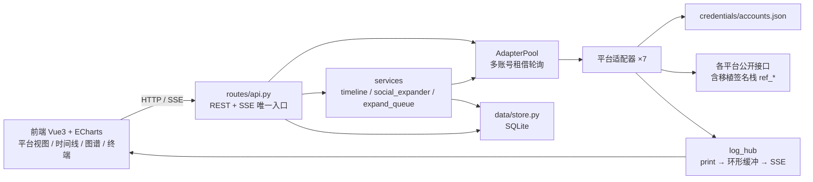
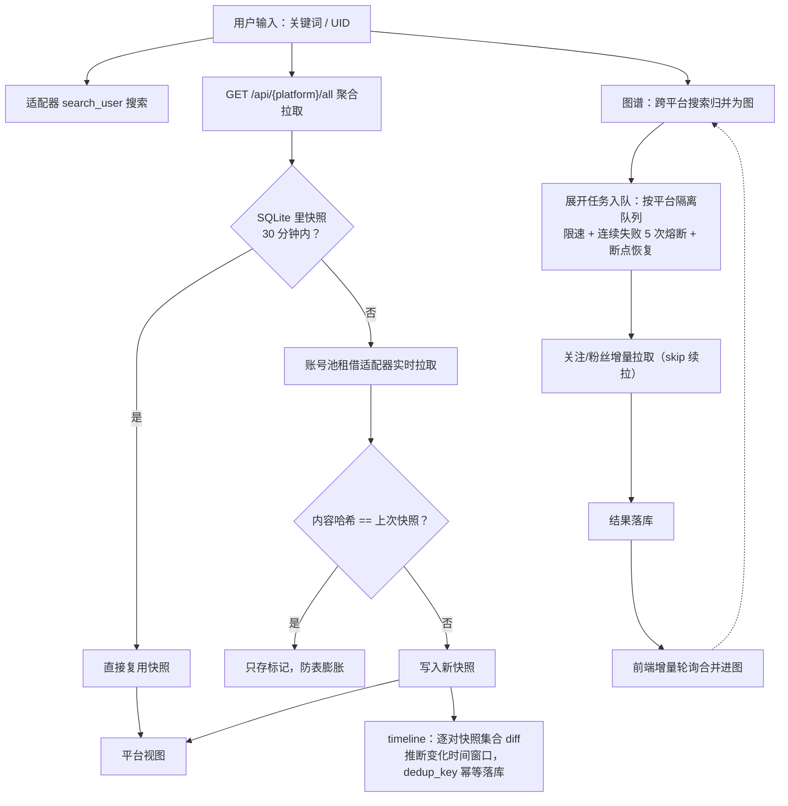

# Sight

这是一个基于视奸对象在各平台公开数据进行一系列推理排查的项目,核心思想是利用看似无关紧要的数据形成对该视奸对象及其社交网络的全面认知

- **功能一**：直接查询对象在各平台的公开数据（基本基于其他开源项目的手段）
- **功能二**：通过对比不同时间对象在各平台的公开数据，推测对象一段时间内的行为
- **功能三**：通过分析对象在各平台的公开数据，生成社交网络关系图谱
- **功能四**（开发中）：接入agent生成一站式的人物形象侧写

目前支持的平台有：网易云音乐、哔哩哔哩、抖音、QQ音乐、微博、小红书
## 快速开始

环境要求：Python 3.10+，Node.js 20+（前端构建与抖音签名）。

```bash
python -m venv .venv
.venv\Scripts\activate          # Windows；macOS/Linux 用 source .venv/bin/activate
pip install -r requirements.txt
python run.py                   # 监听 http://127.0.0.1:5001
```

前端二次开发：

```bash
cd frontend
npm install
npm run dev       # Vite 开发服务器，默认 5173
npm run build     # 构建到 app/web/，由 Flask 托管
```

## Cookie 配置

所有凭证统一存储在 `credentials/accounts.json`。
推荐在面板中配置：图谱页平台状态条 →「配置 Cookie」粘贴即可，主账号与多账号（并发加速）在同一弹窗管理。

也可以手动编辑 `credentials/accounts.json`，每个平台是一个账号数组：

```json
{
  "netease": [
    { "id": "primary", "name": "主账号", "cookie": "k=v; k2=v2", "enabled": true },
    { "id": "acc_xxx", "name": "账号2", "cookie": "k=v", "enabled": true }
  ]
}
```

- `id` 为 `primary` 的是主账号（历史记录等私有数据接口固定使用，不可删除），其余为附加账号
- `enabled: false` 可把账号移出多账号轮询（不删除凭证）
- Cookie 内容在下次请求时生效；增删账号建议走面板（会同步重建账号池）

未配置 Cookie 也能启动，但对应平台功能会受限。小红书 Cookie 可能过期，需要重新获取。

## 架构与数据流



一次查询的工作流：



关键约定与接入新平台的完整约束见 [`docs/MANUAL.md`](docs/MANUAL.md)：

- 适配器与服务层失败一律 `raise`（带平台前缀/账号标签/风控码），不返回空值伪装成功；唯一转 JSON 的边界在 REST 层
- `frontend/src/platforms.js` 与适配器返回字段严格对应，改一边要同步另一边
- 移植代码的上游同步范围见 [`docs/MANUAL.md`](docs/MANUAL.md)

## 项目结构

```text
app/
├── routes/api.py            REST 路由（唯一把异常转 JSON 响应的地方）
├── platforms/
│   ├── base.py              适配器抽象接口 + 数据模型
│   ├── pool.py              多账号适配器池（租借制轮询）
│   ├── __init__.py          平台工厂注册中心（延迟构造）
│   └── <platform>/          7 个平台适配器（移植签名栈见 docs/MANUAL.md）
├── services/
│   ├── timeline.py          统一时间线（快照对比推断时间窗口）
│   ├── social_expander.py   社交展开核心
│   ├── expand_queue.py      按平台隔离的展开队列（限速/熔断/断点恢复）
│   ├── log_hub.py           stdout 镜像 → 环形缓冲 → SSE
│   └── qqmusic_qr_login.py  QQ音乐扫码登录（可选 Playwright）
├── data/store.py            SQLite 快照/时间线/图谱/展开任务持久化
├── credentials/             凭证管理（accounts.json 唯一存储）
└── web/                     前端构建产物（勿手改）

frontend/src/
├── store.js                 全局状态与数据加载编排
├── platforms.js             平台元信息与渲染配置（与后端字段契约）
└── components/View*.vue     平台视图 / 时间线 / 关系图谱 / 终端
```

## 第三方仓库声明

本项目移植或参考了以下开源项目，感谢原作者：

| 上游仓库 | 许可 | 在本项目中的使用 |
|------|------|------|
| [cv-cat/DouYin_Spider](https://github.com/cv-cat/DouYin_Spider) | 仓库未附 LICENSE | 抖音 API 与签名代码**移植**为 `app/platforms/douyin/ref_*`。**原仓库有 bug（关注列表接口）不可直接使用**，以修复版 fork [chenglei6-arch/DouYin_Spider](https://github.com/chenglei6-arch/DouYin_Spider) 为准 |
| [cv-cat/Spider_XHS](https://github.com/cv-cat/Spider_XHS) | 仓库未附 LICENSE | 小红书 PC 签名栈**移植**为 `app/platforms/xhs/ref_*` |
| [nghuyong/WeiboSpider](https://github.com/nghuyong/WeiboSpider) | MIT | 微博关注/粉丝列表请求构造参考，未复制代码 |

上游仓库的本地参考副本在 `reference/`（git 忽略）；同步范围与本地修复见 [`docs/MANUAL.md`](docs/MANUAL.md)。

## 文档

- [`docs/API.md`](docs/API.md)：REST / SSE 接口一览
- [`docs/MANUAL.md`](docs/MANUAL.md)：平台实现与坑、错误约定、接入新平台清单、上游同步范围
